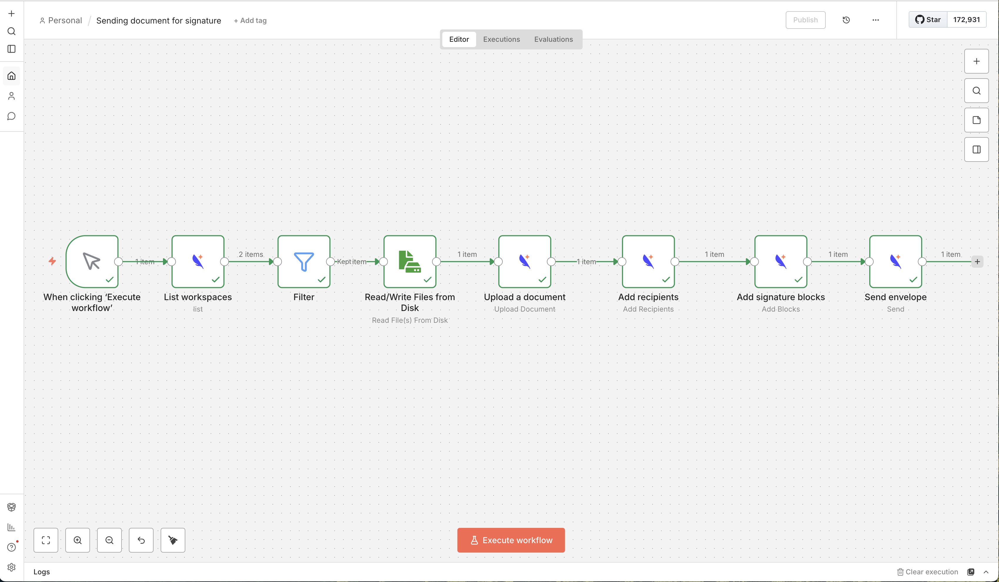

# n8n-nodes-subnoto

n8n community node to integrate with [Subnoto](https://subnoto.com) for document signing. Uses the [Subnoto TypeScript SDK](https://subnoto.com/documentation/developers/sdks/typescript).



## Operations

- **Upload Document** - Upload a PDF or Word document and create an envelope.
- **Add Recipients** - Add recipients to an envelope.
- **Add Blocks** - Add signature blocks to a document.
- **Send** - Send the envelope to recipients.
- **List Workspaces** - List all workspaces the API key owner is a member of.

## Credentials

Create a **Subnoto API** credential with:

- **API Base URL** - e.g. `https://enclave.subnoto.com`
- **Access Key** - Your API access key
- **Secret Key** - Your API secret key
- **Unattested Mode** - Optional (default: false)

## Development

### Using the Dev Container

1. Open the project in VS Code (or Cursor) and **Reopen in Container** (Dev Containers extension).
2. After the container is built, dependencies are installed and the project is built automatically (`postCreateCommand`).
3. Start n8n to test the node:
    ```bash
    npx n8n start
    ```
4. Open http://localhost:5678. The Subnoto node is loaded from the workspace via `N8N_CUSTOM_EXTENSIONS`.
5. Add a Subnoto API credential and run a workflow with the Subnoto node.

### Local (without Dev Container)

1. Install dependencies: `npm install`
2. Build: `npm run build`
3. Link for local n8n:
    ```bash
    mkdir -p ~/.n8n/custom && cd ~/.n8n/custom && npm init -y && npm link /path/to/n8n-node
    ```
4. Start n8n: `n8n start` (or `npx n8n start`)

### Scripts

- `npm run build` - Build the node
- `npm run build:watch` - Watch and rebuild
- `npm run lint` - Lint
- `npm run lint:fix` - Lint and fix

## License

MIT
